# LLM Scholar Verifier

Most open-source LLMs such as ChatGPT and Claude are known to miss capturing the dense and nuanced information found in academic literature. These models are known to have a training corpus largely based on the internet, which contains a lot more misinformation relative to peer-reviewed papers. This can lead the LLM to provide confident-looking responses instead of ones grounded in evidence. As a result, scholars and students doing research risk harming the quality of their own literature review process while using these models with the intention of speeding up the search process. This automated academic claim verification system that decomposes LLM-generated answers into verifiable propositions, retrieves supporting evidence from live scientific literature (arXiv, Semantic Scholar), and scores each claim using a Bayesian evidence accumulation framework. Due to the limited evidence corpus, I have decided to frame this tool as a decision-support tool offering validity and confidence scores instead of binary 'true'/'false' claim detection.

---

## Architecture

### Pipeline Overview

```
User Query (LLM Answer)
        │
        ▼
Proposition Extraction (spaCy dependency parsing)
        │
        ▼
Keyword Extraction (POS-tagged: acronyms, proper nouns, numeric terms)
  + WordNet synonym expansion
        │
        ▼
Multi-source Retrieval (arXiv + Semantic Scholar, up to 1000 papers/source)
        │
        ▼
Stage 1 — Abstract-level Hybrid Triage (MiniLM + BM25, threshold 0.1)
        │
        ▼
Stage 2 — PDF Download (batched parallel)
        │
        ▼
Stage 3 — Sentence-level Hybrid Scoring (MiniLM + BM25)
        │
        ▼
Stage 4 — NLI Zero-Shot Classification (cross-encoder/nli-deberta-v3-base)
        │
        ▼
Bayesian Evidence Accumulation (Beta distribution)
        │
        ▼
Validity Score + 95% Credible Interval
```

---

### Key Components

#### 1. Hybrid Retrieval (MiniLM + BM25)
Applied at both abstract triage and sentence scoring levels.

- **Dense (MiniLM `all-MiniLM-L6-v2`)** — semantic similarity, handles paraphrases and concept-level matches
- **Sparse (BM25 on POS-extracted keywords)** — exact match on acronyms and domain jargon (e.g. ANOVA, p-value, MSE)
- **Fusion:** `score = 0.6 × MiniLM_sim + 0.4 × BM25_normalized`

This hybrid approach ensures both semantic relevance and lexical precision — critical for statistics and ML terminology.

#### 2. Query Expansion
Keywords are expanded with WordNet synonyms before querying arXiv and Semantic Scholar, broadening recall without diluting precision.

#### 3. NLI Cross-Encoder (replacing counterfactual analysis)
Each retrieved sentence is classified against the original claim using `cross-encoder/nli-deberta-v3-base` (zero-shot):

| Label | Meaning | Beta update |
|---|---|---|
| `entailment` | Sentence supports the claim | α += entailment_prob |
| `contradiction` | Sentence contradicts the claim | β += contradiction_prob |
| `neutral` | No signal | ignored |

This replaces the previous syntactic counterfactual negation approach, which failed in embedding space because MiniLM does not encode logical negation.

#### 4. Bayesian Evidence Accumulation
For each paper, sentence-level NLI probabilities are accumulated into a Beta(α, β) posterior:

```
α = 1 + Σ entailment_probs
β = 1 + Σ contradiction_probs
validity_score = α / (α + β)
uncertainty    = CI_high - CI_low   (95% credible interval width)
```

Claims with more retrieved evidence produce narrower CIs (lower uncertainty). The framework naturally handles varying evidence volume per claim.

#### 5. FAISS Semantic Cache
Query results are cached using FAISS `IndexFlatIP` over `all-MiniLM-L6-v2` embeddings. On a cache hit (cosine similarity ≥ 0.90), the full pipeline is skipped — dramatically reducing API calls and compute for repeat or paraphrased queries.

---

## Pipeline Versions & Results

### Version 1–3 (Legacy Pipeline)

Versions 1–3 used TF-IDF/KNN for retrieval, Doc2Vec for sentence scoring, and syntactic counterfactual negation for claim-level agreement analysis.

**Dataset:** 64 LLM answers across Statistics & Data Analytics and Machine Learning topics.

| Metric | V1 | V2 | V3 |
|---|---|---|---|
| Avg Validity Score | 43.4% | 31.9% | 70.5% |
| Avg Agreement Rate | 91.5% | 72.8% | 70.5% |
| Avg Disagreement Rate | 4.5% | 6.6% | 6.8% |
| Ratio of Zero Scores | 4.0% | 20.6% | 8.8% |
| Ratio of Missing (Neutral) | 68.2% | 83.7% | 15.8% |
| Questions with Validity > 80% | 1 / 25 | 0 / 34 | 18 / 34 |

**V3 charts (02/19/2026):**

<p float="left">
  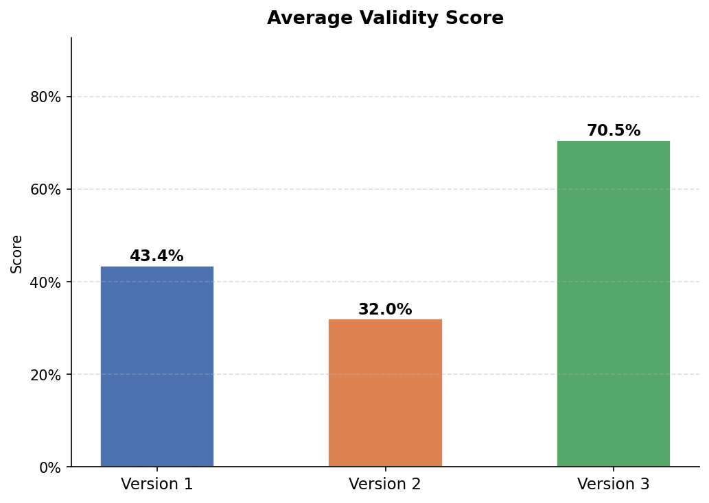
  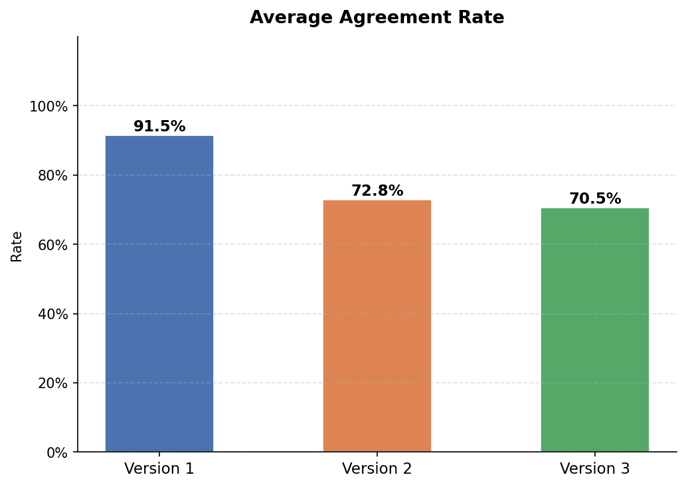
</p>
<p float="left">
  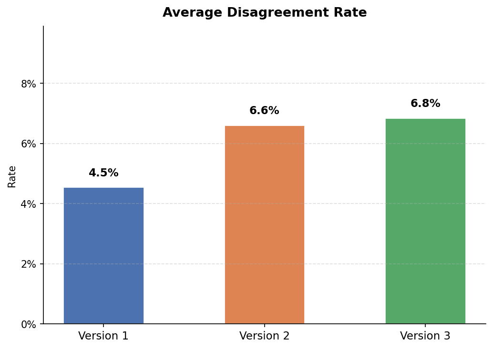
  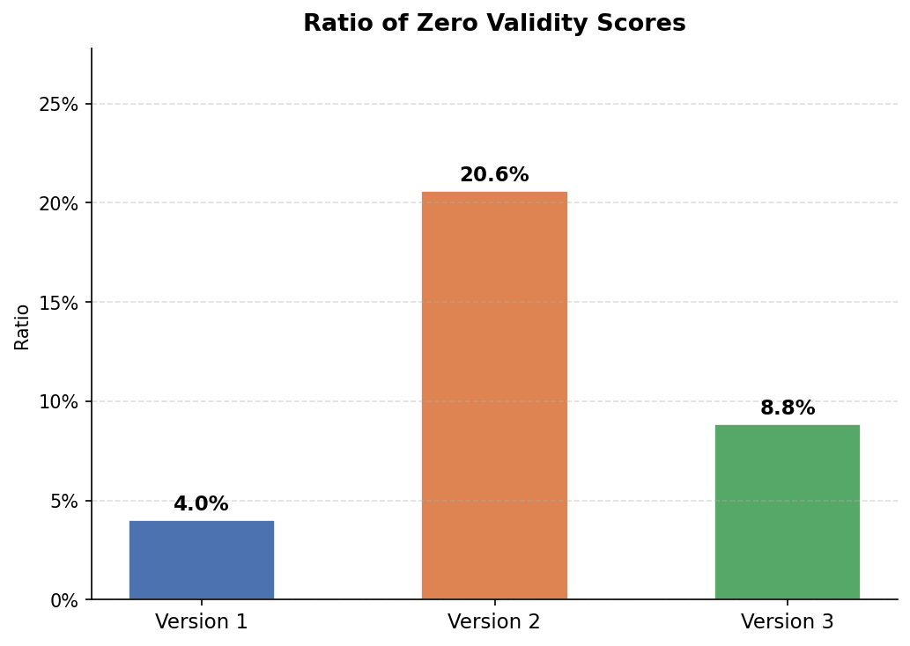
</p>
<p float="left">
  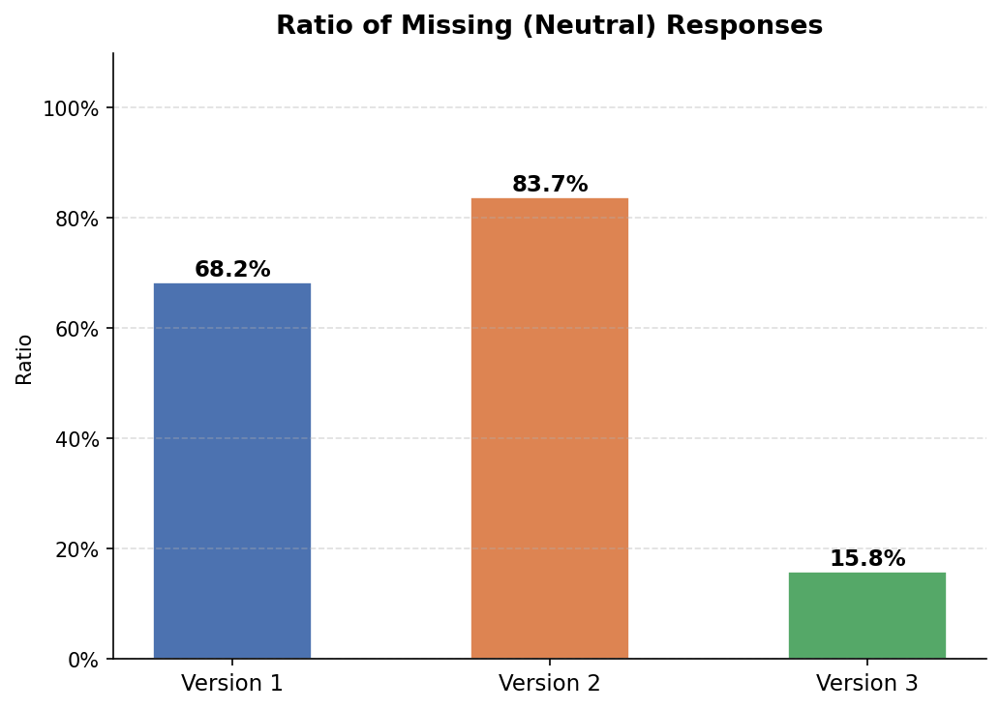
  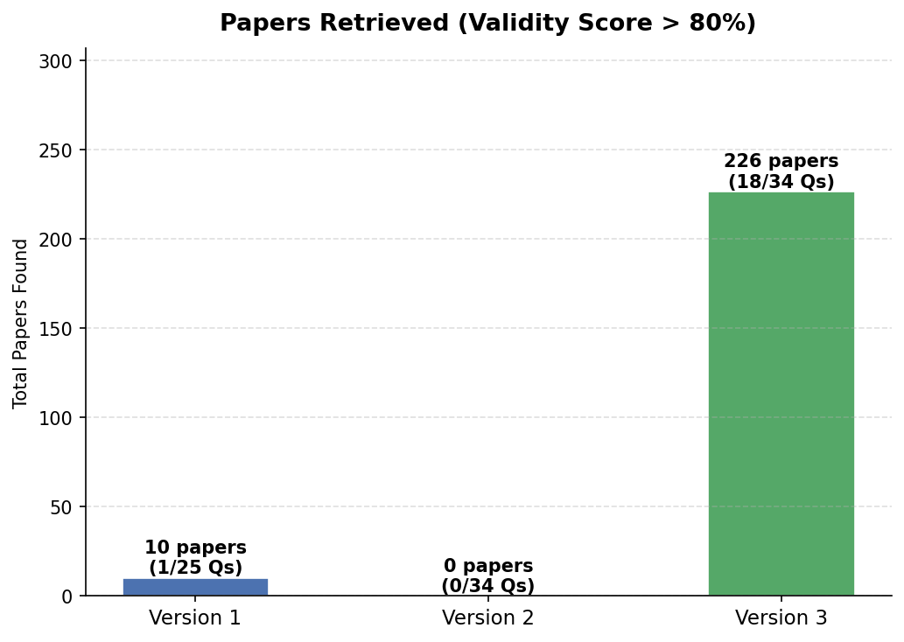
</p>

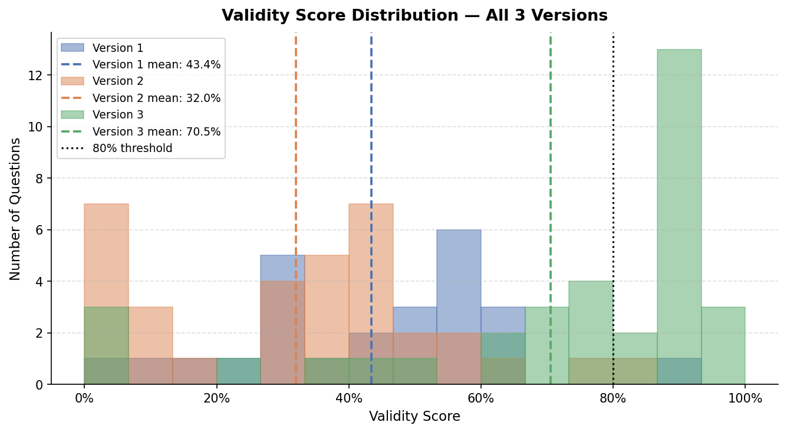

---

### Extended Pipeline — Initial Results

First run of the new architecture with MiniLM hybrid retrieval and Bayesian scoring. NLI cross-encoder not yet integrated at this stage.

**Early metrics (partial dataset):**
- Uncertainty range significantly narrowed vs V1–V3
- Validity scores showing meaningful spread (0.5–0.94)

<p float="left">
  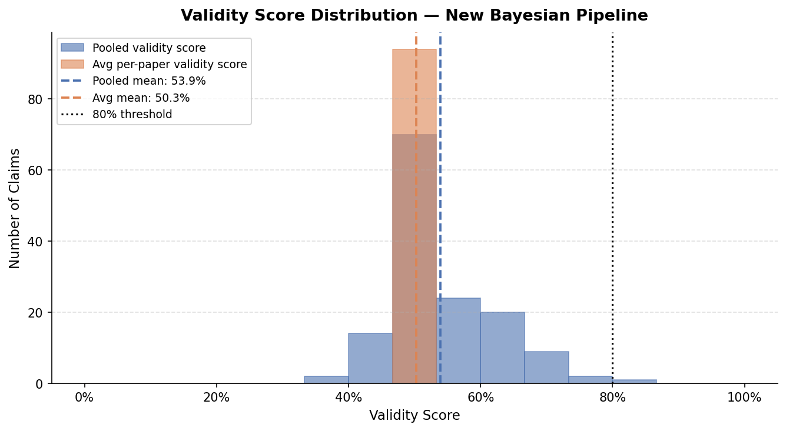
  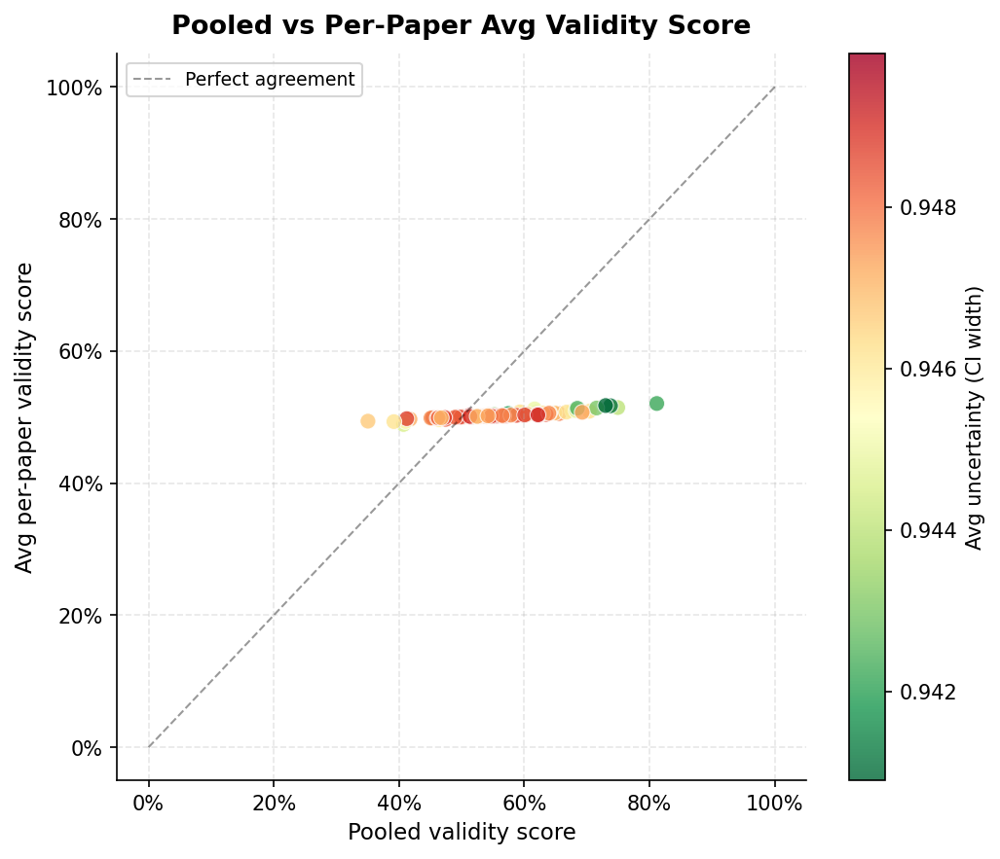
</p>
<p float="left">
  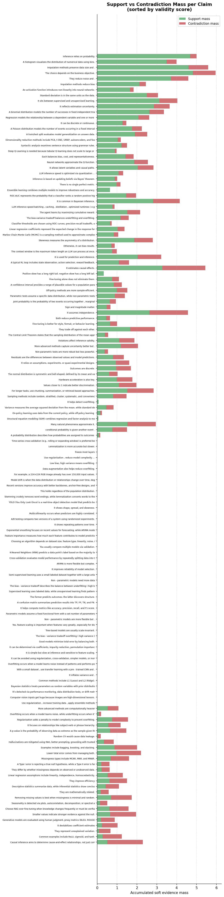
  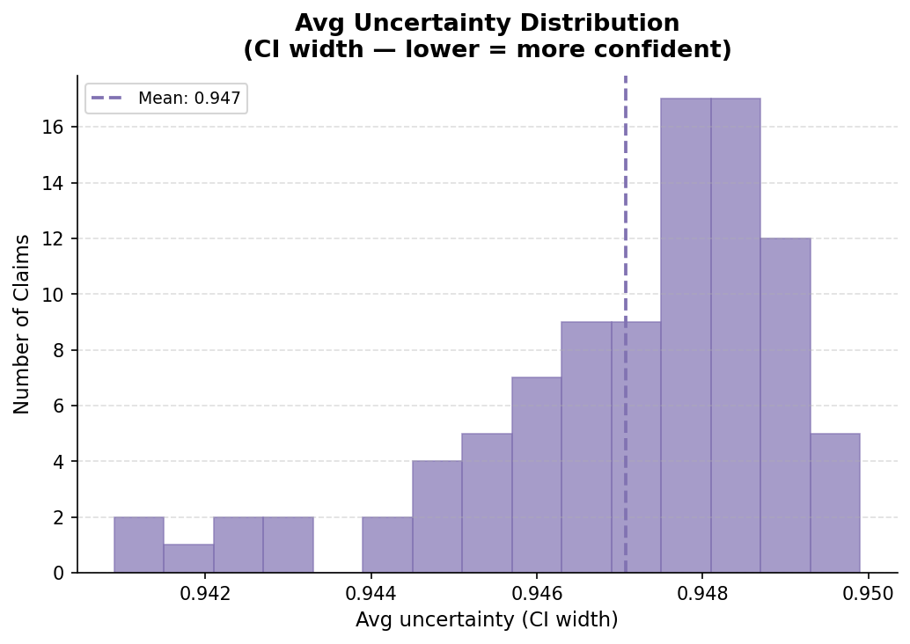
</p>

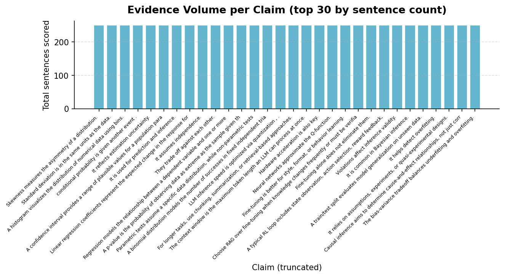

---

### Extended Pipeline + NLI — Results (In Progress)

Full pipeline with `cross-encoder/nli-deberta-v3-base` scoring. Results will be updated once the full 64-claim warm-up completes.

**Preliminary metrics (12 claims):**
- Uncertainty mean: **0.142** (down from ~0.94 with counterfactual approach)
- Validity mean: **0.748**
- Entailment / Contradiction / Neutral split: **10,546 / 433 / 2,403** sentences

> Charts will be added here once full results are available.

---

## Stack

| Component | Technology |
|---|---|
| Backend | FastAPI + SSE streaming |
| Frontend | Next.js |
| Embeddings | `sentence-transformers/all-MiniLM-L6-v2` |
| NLI | `cross-encoder/nli-deberta-v3-base` |
| Sparse retrieval | BM25 (`rank-bm25`) |
| Vector cache | FAISS (`faiss-cpu`) |
| NLP | spaCy `en_core_web_sm` |
| Bayesian stats | SciPy Beta distribution |
| Data sources | arXiv API, Semantic Scholar API |

---

## Setup

```bash
# Backend
cd backend
pip install -r requirements.txt
python -m spacy download en_core_web_sm
python -m uvicorn main:app --reload --port 8000

# Frontend
cd frontend
npm install
npm run dev
```

Open `http://localhost:3000`

---

## Cache Warm-up

To pre-populate the FAISS cache with dataset queries:

```bash
cd "Group Project"
python MCP_test_extension.py
```

To generate performance charts from cached results:

```bash
python MCP_metrics.py
```
